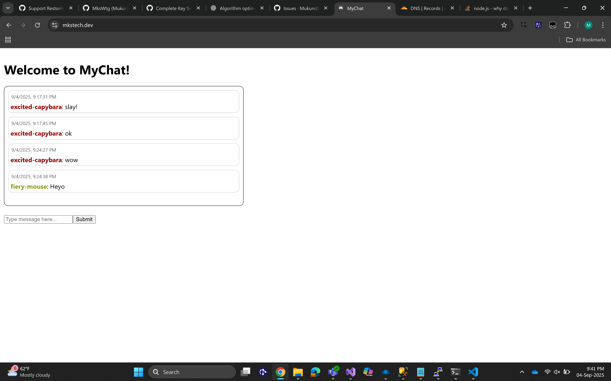

# MyChat

- Accessible at https://www.mkstech.dev
- Chat app for talking to strangers on the internet.
- Sends messages to db via https (encrypted)
- Publishes your messages to the world via secure websocket for anyone listening
- Works if discord/instagram is blocked

## Features

- Randomized profile name and colour
- Remembers your name even on different browsers and incognito
- Messages persist

## Soon to Come

- Profile pictures
- Friends and friend requests
- Private messages and groupchats
